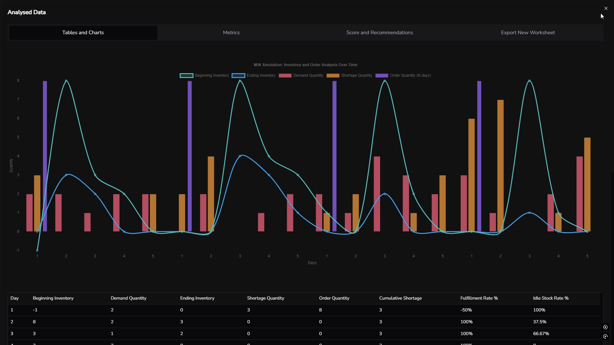
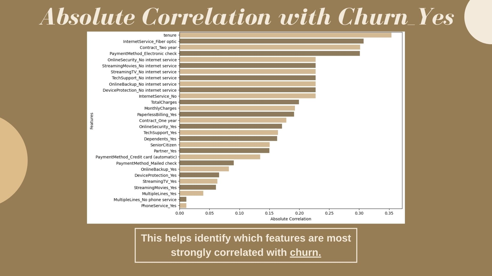
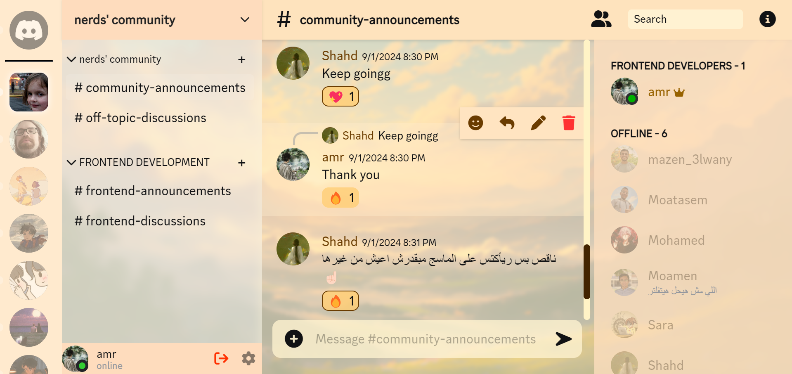

  

<h3 align="center">Frontend Developer | React Specialist | 🌟 Crafting Stunning Web Experiences  </h3>

I'm passionate about building modern, user-friendly interfaces with a focus on creativity, quality, and problem-solving. My goal is to become a **Full-Stack Developer** with strong expertise in **Machine Learning** for impactful solutions.

## 🚀 **Skills & Expertise**
### Frontend Development  
 

 
 

### Machine Learning & Data Analysis

         

### Other Programming Languages
     

 

---

## 🛠️ **Projects**  

### **Simulation Analysis Tool**  
- A system simulation tool with seamless user input, data processing, and Excel integration.  
- **Technologies**: React, Chart JS, Excel JS. 

### **Customer Retention Analysis Tool**  
- Machine learning project to analyze and reduce churn for telecom services.  
- **Technologies**: Python, scikit-learn, Pandas 

### **Message Platform (Discord Equivalent)**  
- A real-time messaging app with responsive design and smooth user experience.  
- **Technologies**: CSS, JavaScript, Firebase  

## 📈 **GitHub Stats**

## 🌟 **Goals**  
- Master backend technologies and become a **Full-Stack Developer**.  
- Leverage **Machine Learning** for real-world applications.  
- Build impactful web applications that merge functionality with aesthetics.

---

## 📫 **Connect with Me**  
💼 [LinkedIn](https://www.linkedin.com/in/amr-mosallem-0540b9314/)  
🌐 [Portfolio](https://effulgent-crisp-9fc1c2.netlify.app/)  
📧 [Email](amromsllam@gmail.com)

